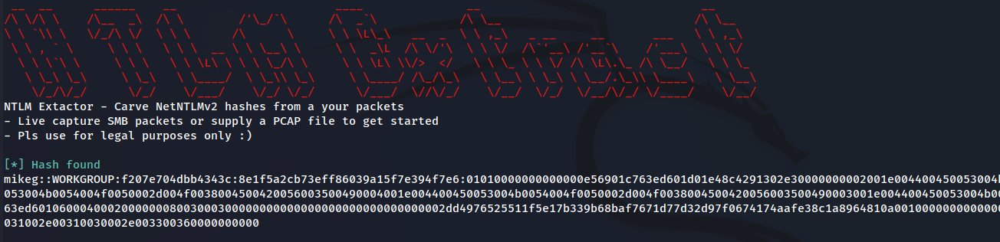

<h1 align="center">
   
  
   
</h1>

# NTLM Extractor
Tool used to extract NetNTLMv2 hashes from your packets \
Can be used to live caputre packets (be careful with this) or to process a PCAP file

# Setup
## Requirements 
- Make sure to have go installed, all needed modules will be handled by go

## Installation
- `go build -o bin/ntlmextractor src/main.go`
- `go run src/main.go`

# Usage
## PCAP Processing
- A valid PCAP file with SMB2 packets is needed for PCAP processing
- `bin/ntlmextractor -f <path to pcap file> >> hash; hashcat -m 5600 -a 0 hash /usr/share/wordlists/rockyou.txt`

## Live Capturing
- If no device is supplied, NTLM Extract will list all available devices
- `bin/ntlmextractor -l -d <device>`

# Examples
## PCAP Processing
- A sample PCAP is supplied to test the processing feature
- `bin/ntlmextractor -f capture.pcap`
## Live Capturing
- On initialization, NTLM Extract will probe open devices, and open the device supplied
- Them NTLM Extract will wait to capture 100 SMB2 packets, once captured, the packets will be analyzed for NetNTLMv2 hashes
- `bin/ntlmextractor -l -d eth0`
